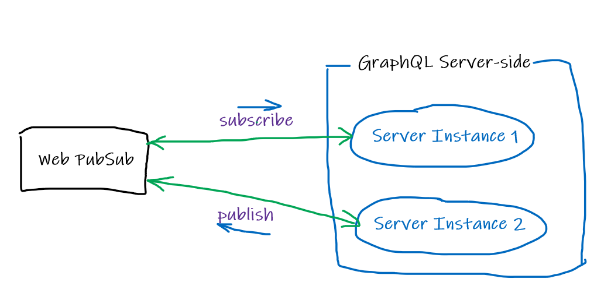

# Implement GraphQL Subscription using Web PubSub

Clients connect to the server using WebSocket connections when using GraphQL Subscriptions. 

Web PubSub can help maintianing the WebSocket connections so that the app servers can get rid of such work and easily scale.

In this article, we use Apollo.JS as the GraphQL library and let's walk through how we leverage Web PubSub in Apollo.js to help handle WebSocket connections.

Web PubSub can act as two roles when used in GraphQL Subscription:
1. Help maintain the client WebSocket persistent connections
    

2. Acts as the backend Pub/Sub engine
    

First let's setup the Apollo subscription.
You can see that with all these set, the client establishes a WebSocket connection with the Apollo server.

What if Apollo server needs to upgrade, what if we scale to use multiple instances for more concurrent clients.

WebPubSub can not only helps to maintain the WebSocket connections, but also acts as a backend Pub/Sub engine communicating between the multiple Apollo server instances.

Let's update the Apollo server to use Web PubSub.

First let's see how to use Web PubSub to maintain the WebSocket connections.

Change `subscriptionPath` to use the Web PubSub client endpoint, by leveraging `@azure/web-pubsub` package.

```batch
npm install @azure/web-pubsub
```
[Subscriptions in Apollo Server](https://www.apollographql.com/docs/apollo-server/data/subscriptions/) explains how to setup subscriptions in Apollo Server. When using Web PubSub, there is no need to create an `http.Server` any more, instead, use `WebPubSubServer` to replace the underlying transport layer and help dispatch incoming and outgoing messages:
```

```
